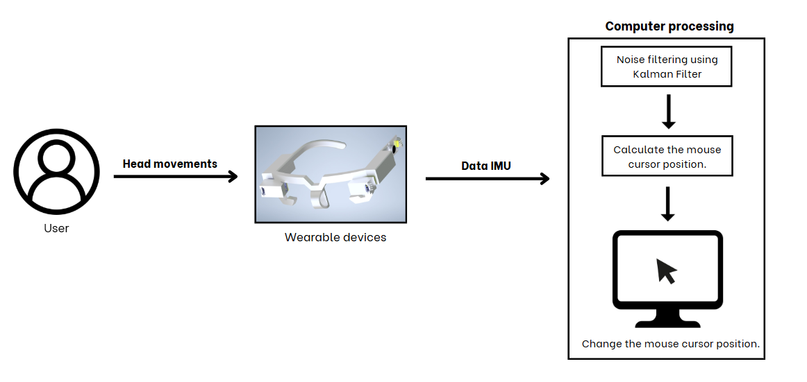
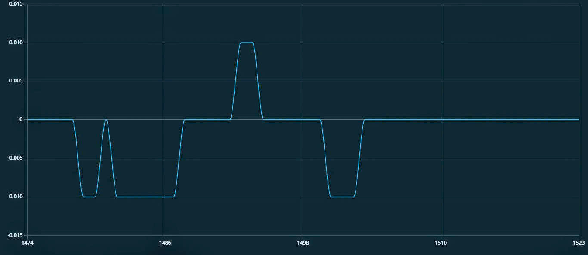

# **Headmouse Hardware**

  

---

## **Abstract**

This project proposes a head-movement-based mouse control device to assist individuals with limited hand mobility. The device uses an IMU sensor (MPU6050) to capture head movements and convert them into cursor motion. The data is processed using a Kalman Filter to reduce noise and improve stability.

The system uses infrared sensors (TCRT5000) to detect eye blinking and perform mouse click actions. An Arduino Leonardo microcontroller, based on the ATmega32u4 chip with built-in USB HID capability, allows direct use of the Mouse library to control the computer cursor. 

---
## **Results (Kalman Filtering Performance)**

To evaluate the effectiveness of the Kalman Filter, raw IMU data and filtered data were compared.

  
 
<i>Figure 1. Raw gyroscope data before filtering (noisy signal).</i>
 
  
 
<i>Figure 2. Sensor data after applying Kalman Filter (smoothed signal).</i>

The results show that the Kalman Filter significantly reduces noise and stabilizes the signal.

## **Contributors**
**Lam Phuc**  
